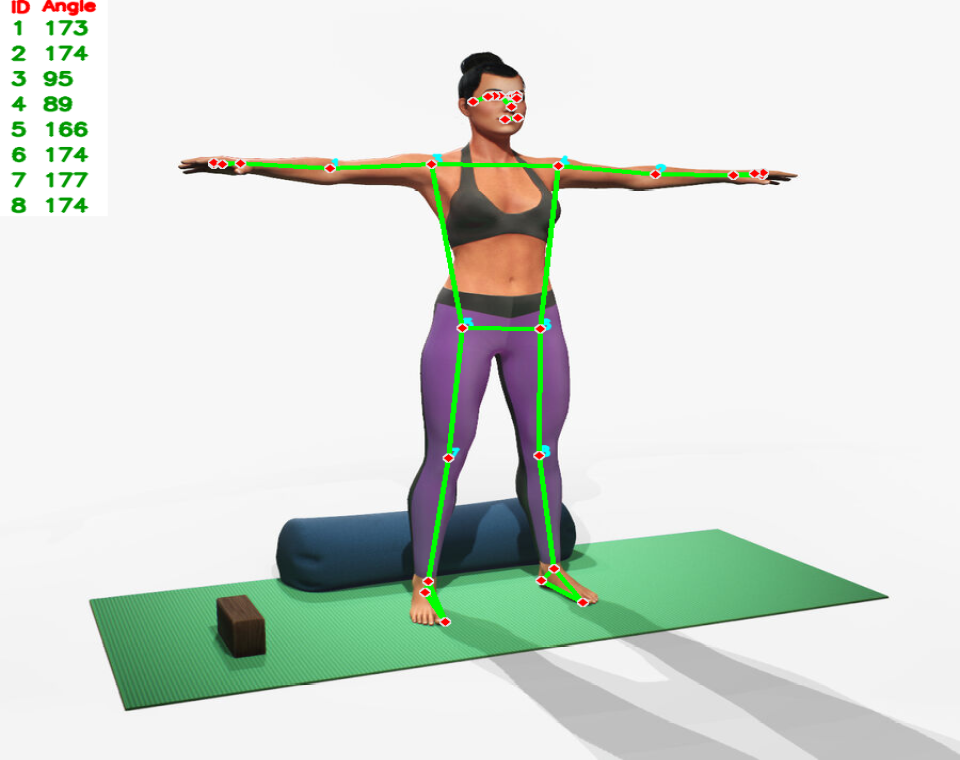
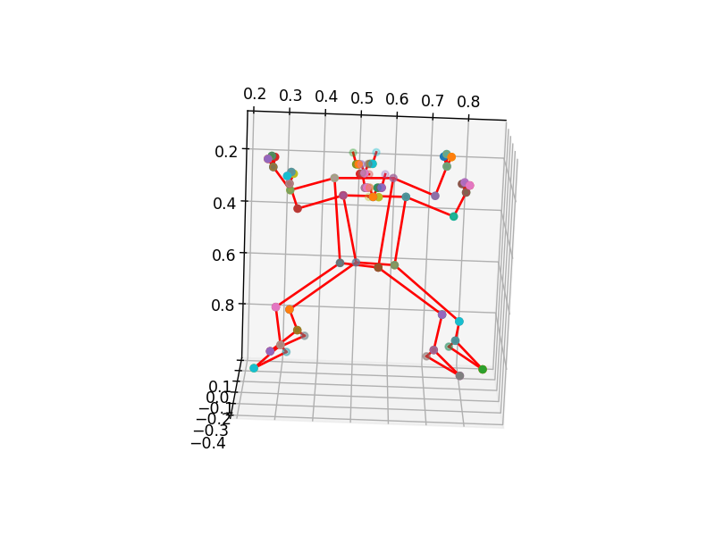

# Yoga Pose Trainer (Detector and Corrector)




The Yoga Pose Trainer (Detector and Corrector) is a Python-based application that detects and corrects yoga poses using computer vision techniques. This project utilizes Python, OpenCV, MediaPipe, NumPy, Pandas, Celluloid, and Pyshine, and implements a Dynamic Time Warping (DTW) algorithm for pose correction.

## Table of Contents

- [Features](#features)
- [Technologies Used](#technologies-used)
- [Installation](#installation)
- [Usage](#usage)
- [Contributing](#contributing)


## Features

- Detect yoga poses using OpenCV and MediaPipe.
- Correct yoga poses using a DTW (Dynamic Time Warping) algorithm.
- Visualize pose detection and correction using Celluloid and Pyshine.
- Analyze pose data with NumPy and Pandas.

## Technologies Used

- Python
- OpenCV
- MediaPipe
- NumPy
- Pandas
- Celluloid
- Pyshine

## Installation

To run this project locally, follow these steps:

1. Clone the repository:

    ```bash
    git clone https://github.com/omgupta7352/Yoga-Pose-Trainer.git
    ```

2. Navigate to the project directory:

    ```bash
    cd yoga_pose_trainer
    ```

3. Create a virtual environment and activate it:

    ```bash
    python -m venv venv
    source venv/bin/activate  # On Windows use `venv\Scripts\activate`
    ```

4. Install the dependencies:

    ```bash
    pip install -r requirements.txt
    ```

## Usage

1. Ensure your webcam is connected.
2. Run the application:

    ```bash
    python main.py
    ```

3. Follow the on-screen instructions to perform and correct yoga poses.

## Contributing

Contributions are welcome! If you would like to contribute to this project, please follow these steps:

1. Fork the repository.
2. Create a new branch for your feature or bugfix:

    ```bash
    git checkout -b feature/your-feature-name
    ```

3. Commit your changes:

    ```bash
    git commit -m 'Add some feature'
    ```

4. Push to the branch:

    ```bash
    git push origin feature/your-feature-name
    ```

5. Open a pull request on GitHub.


